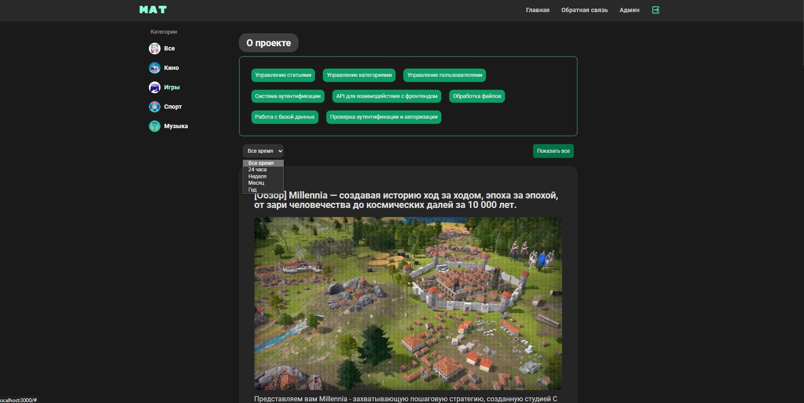

# 📝 Article Management Website
## 📄 Description
This project is a Node.js-based web application designed for managing articles. It features an administrative panel that allows for the addition, editing, and deletion of articles. The project uses MySQL for data storage and includes functionalities for user registration and authentication. It also ensures a consistent user experience with a unified styling across the site.

## 🌟 Key Features
-   **CRUD Operations:** Perform create, read, update, and delete operations on articles.

-   **Administrative Panel:** Intuitive interface for managing website content.

-   **User Authentication:** Registration and login functionality to secure access to certain areas of the site.
Responsive Design: Consistent and user-friendly interface with proper styling using CSS.

-   **Routing:** Well-defined routing using Express.js to handle various HTTP methods (GET, POST, PUT, DELETE).
Error Handling: Custom 404 page and appropriate response codes for different HTTP requests.
## 🛠️ Technologies Used
-   **Node.js:** Backend runtime environment.

-   **Express.js:** Web framework for Node.js to handle routing and middleware.

-   **EJS:** Templating engine for rendering HTML pages.

-   **MySQL:** Relational database management system for storing article data.

-   **CSS:** Styling the website for a consistent look and feel.

-   **JavaScript:** Client-side scripting for dynamic interactions.
## ⚙️ Installation
1.  **Clone the repository:**
```bash
    git clone https://github.com/your-username/article-management-website.git
```
2. **Navigate to the project directory:**
```bash
    cd article-management-website
```

3. **Install dependencies:**
```bash
    npm install
```
4. **Set up the database:**
-   Ensure you have MySQL installed and running.

-   Create a database and import the provided SQL schema.
-   Update the database configuration in the project.

5. **Start the server:**
```bash
    npm start
```
6. **Open your browser and navigate to:**
```bash
    http://localhost:3000
```
## 🚀 Usage
-   Access the admin panel to manage articles.

-   Use the registration and login page to create and authenticate user accounts.

-   Browse articles on the main page and use the contact form for feedback.


## 💥 Appearance
### Login page


### Main page


### Feedback page


### Admin page


### 404 page


## 🤝 Contributing
Pull requests are welcome. For major changes, please open an issue first to discuss what you would like to change.

